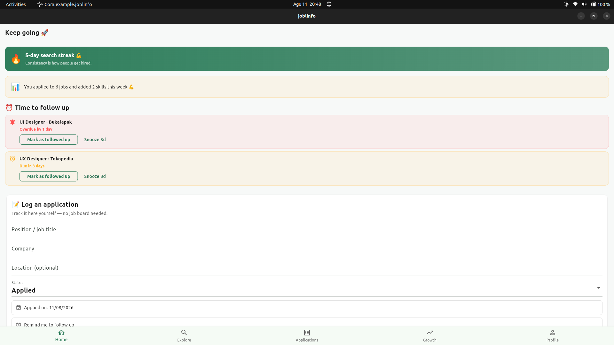
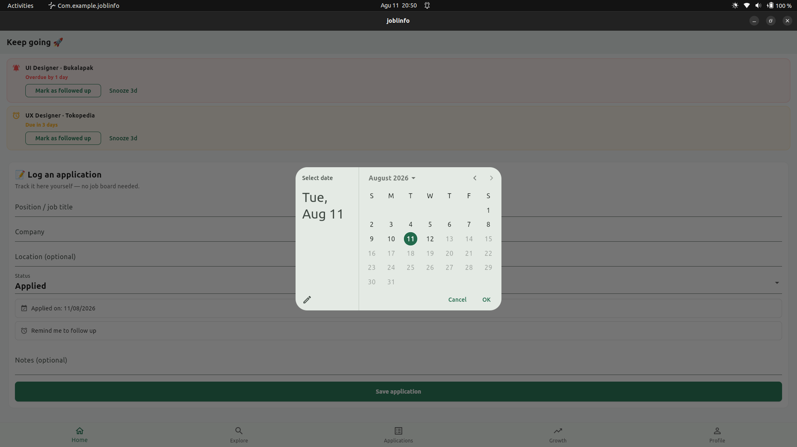
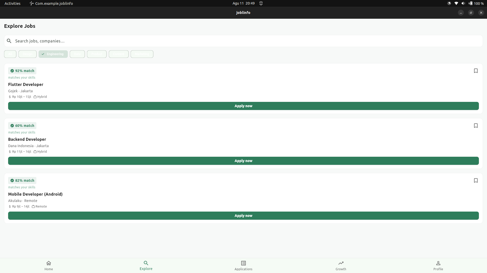
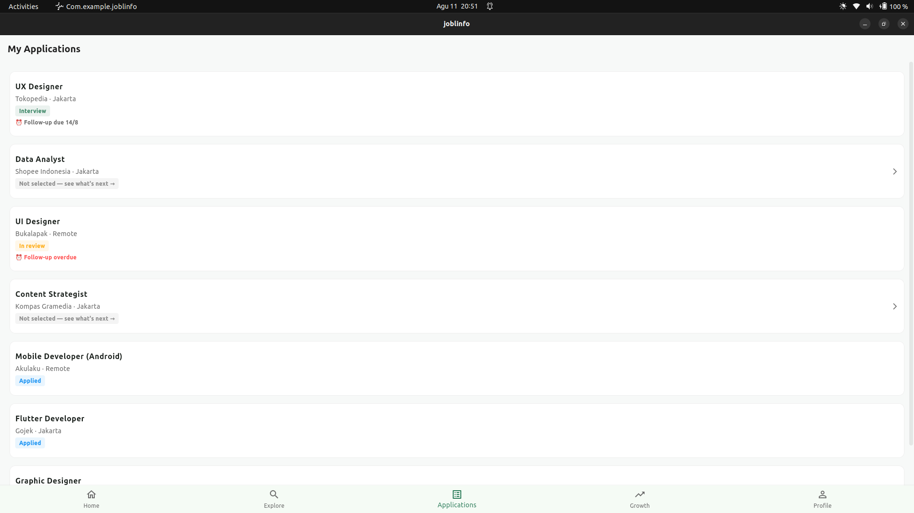
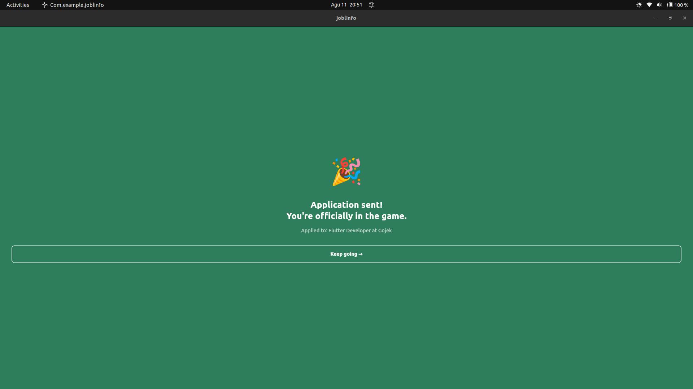
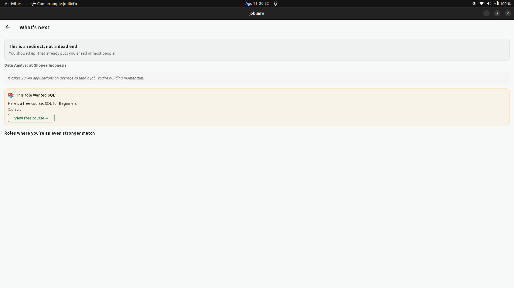
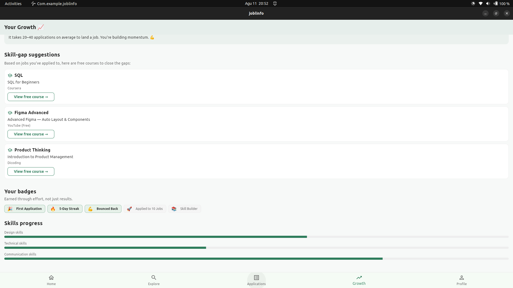
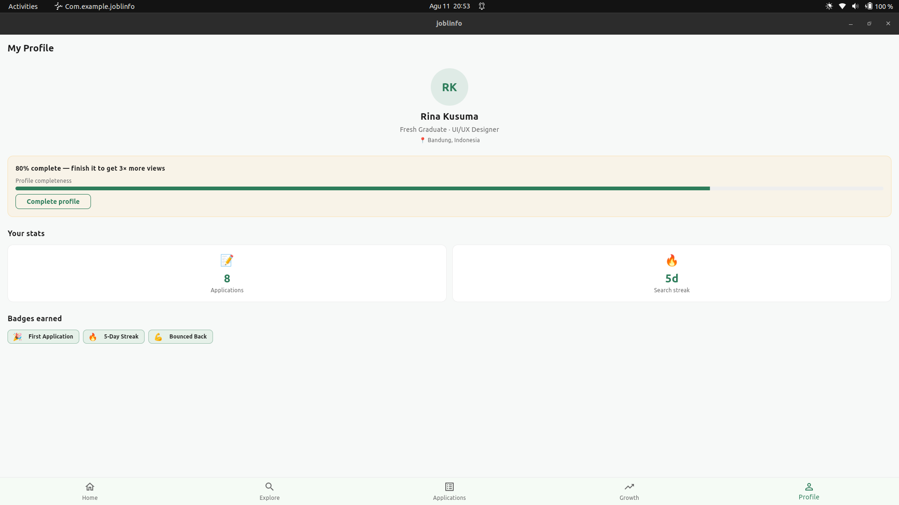

# Joblinfo 💼

**The job-search companion that never lets rejection be a dead end.**

Most job apps optimize for listings. Joblinfo optimizes for **motivation and resilience** — Duolingo-style encouragement, adapted with warmth for the high-stakes, emotionally draining reality of job seeking.

> "You match 85% — go for it!" 🎯

## ✨ Why Joblinfo?

| You feel... | Joblinfo responds with... |
|---|---|
| 😰 Unsure if you're qualified | **Match %** on every job card to build confidence before applying |
| 💔 Crushed by a rejection | **Rejection recovery flow**: empathetic message → skill-gap tip → 3 similar jobs |
| 😮‍💨 Burned out from applying | **Breather mode** — guilt-free re-engagement after repeated rejections |
| 🫥 Like your effort is invisible | **Effort-based gamification** — search streaks, resilience badges, weekly effort recaps |

## 📱 App tour

**Stay motivated daily** — track your streak and plan applications on the built-in calendar:

| Home | Home (Entry & Calendar) |
|---|---|
|  |  |

**Apply with confidence** — explore matched jobs and submit applications:

| Explore | Application | Application Sent |
|---|---|---|
|  |  |  |

**Bounce back and grow** — rejection recovery, skill growth, and your profile:

| What Next | Growth | Profile |
|---|---|---|
|  |  |  |

## 🚀 Getting started

```bash
flutter pub get      # 1. Install dependencies
flutter run          # 2. Run the app (device or emulator required)
flutter test         # 3. Run unit tests
flutter analyze      # 4. Analyse code
```

## 🛠 Tech stack

- **Flutter** (Material 3), mobile-first
- **Provider** for state management
- **Mock / in-memory data** — no backend required, runs out of the box

## 📚 UX process docs

Full design-thinking documentation, from research to testing:

| Phase | Docs |
|---|---|
| 1. Research | `docs/01-research/` |
| 2. Define | `docs/02-define/` |
| 3. Ideate | `docs/03-ideate/` |
| 4. Design | [`docs/04-design/`](docs/04-design/) |
| 5. Handoff | `docs/05-handoff/` |
| 6. Testing | `docs/06-testing/` |

## 🤝 Contributing

Issues and PRs welcome — especially around copywriting for encouragement messages, accessibility, and localization.
